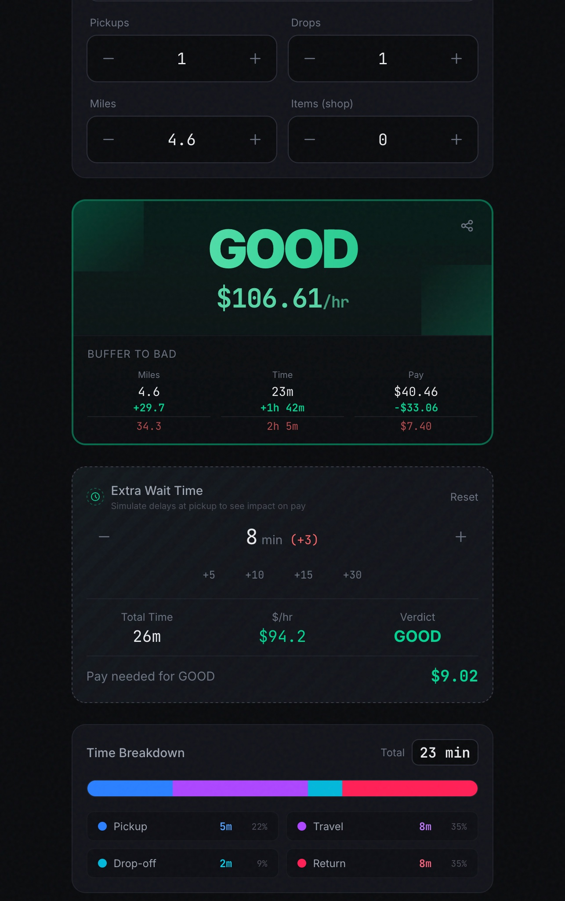
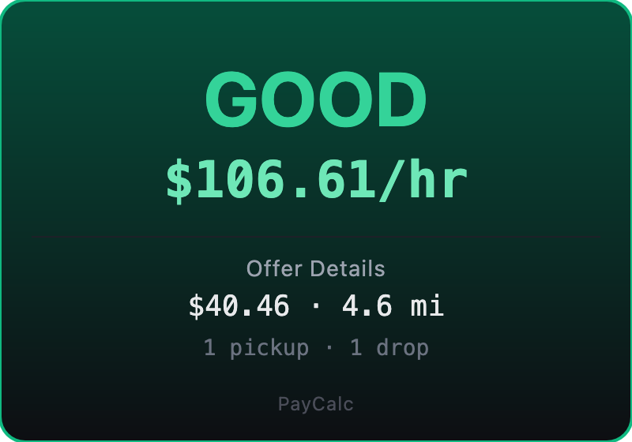

# Pay Calculator

A calculator for gig and delivery workers to evaluate whether an order is worth taking. Works for DoorDash, Uber, Lyft, GrubHub, Instacart and more.



## Features

- **Hourly Rate Calculation** - Instantly see your effective hourly rate based on order details
- **Good/Bad Verdict** - Clear rating system to help you make quick accept/decline decisions
- **Buffer Thresholds** - See exactly how much more time or miles would make an order turn bad
- **Wait Time Simulator** - Model the impact of extra wait time at pickup on your hourly rate
- **Time Breakdown** - Visual breakdown of pickup, travel, drop-off, and return time
- **Shareable Links** - Share order evaluations via URL parameters
- **Screenshot Upload** - Upload a screenshot of an offer to automatically extract pay and mileage details

### Share Feature

Generate shareable links to discuss orders with other drivers.



Example: `https://paycalc-psi.vercel.app/?pay=40.46&miles=4.6`

## Getting Started

```bash
npm install
npm run dev
```

Open [http://localhost:3000](http://localhost:3000) to use the calculator.

## Built With

- [Next.js](https://nextjs.org)
- [React](https://react.dev)
